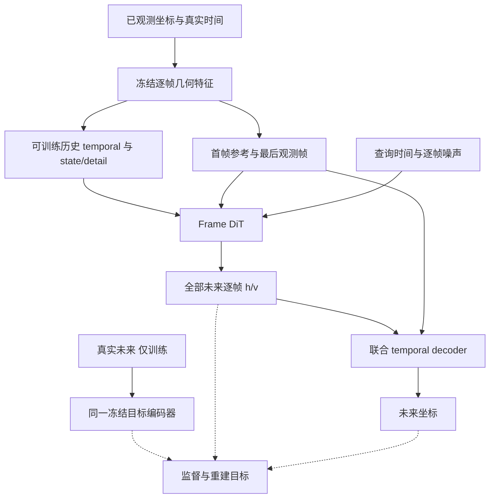

# Frame Joint v1 架构

## 目标与表示

保留 TorchMD 几何表示；压缩已观测历史，联合生成未来每一帧的 latent，用跨整段时间的 decoder 恢复坐标。历史四帧组只是一种 memory 压缩设置，不定义未来输出粒度。不是 R2 回退，也不是新一轮 R 扫参。

约定：B 为体系数，N 为打包原子数，H 为观测帧数，Q 为未来查询帧数，M 为压缩历史组数。所有注意力必须隔离不同体系。原子顺序/ID 在同一轨迹内一致。

| 表示 | scalar | vector |
| --- | --- | --- |
| 冻结逐帧特征 | `[T,N,128]` | `[T,N,3,128]` |
| 历史 memory（投影后） | `[M,N,256]` | `[M,N,3,128]` |
| 未来 flow target / source | `[Q,N,128]` | `[Q,N,3,128]` |
| DiT 工作表示 | `[Q,N,256]` | `[Q,N,3,128]` |
| decoder 输入特征 | `[H+Q,N,128]` | `[H+Q,N,3,128]` |
| decoder 坐标 | `[Q,N,3]` | — |

## 清楚的类型边界

建议沿用现有 types 文件，定义必要的 `FrameLatentBatch`、`ObservedContext`、`QuerySpec`、`HistoryMemory`；不要为每个中间 tuple 建一套抽象框架。

- `ObservedContext`：仅观测坐标/特征、真实时间、有效 mask、体系/原子 ID、已知拓扑、首帧参考和坐标原点。
- `QuerySpec`：查询时间、目标有效 mask；不包含真实未来坐标。
- `FrameLatentBatch`：h/v、时间、mask、打包索引、统计版本；不包含 state/detail 字段。
- 训练目标单独存储，不让 generator 接受整段带真实未来的 batch 再“承诺不读”。

训练可一次算好全 clip 的冻结逐帧特征，但条件构造只选择 observed 子集。推理只能编码输入观测帧。预处理对齐/坐标原点必须由观测参考确定，不能用未来均值或未来构象重新对齐输入。

## 1. 冻结逐帧几何表示

从指定 codec 提取 `frame_encoder` 与 `coordinate_stem`，输出 Haar 前的 h/v。坐标 stem 的特征是目标 latent 的一部分，不是绕过生成器的真实未来坐标旁路。

teacher 始终 eval / requires_grad=False，不进入 optimizer。训练使用 no_grad 得到普通可用于后续 autograd 的张量；若使用 inference_mode，必须确认其输出能安全进入训练算子，不把 inference tensor 错误用于保存反传中间量。

标量按训练集通道统计归一化；vector 只用旋转不变、xyz 共享的通道尺度，不能减一个依赖全局坐标轴方向的 vector 均值。不能逐 clip/逐体系重标定方差。新统计契约与旧四字段统计完全区分。

## 2. HistoryEncoder

一层可训练 temporal 更新，后接现有四帧 Haar / state-detail 及时间条件映射。只压缩完整的已观测四帧组；不足四帧的尾部保留原 token 和 mask。H4/H8 分别 1/2 个压缩时间组，首帧参考/最后观测特征另外提供。不得为补齐 history 而引入未知未来。

重复静态帧必须维持零 detail。temporal 更新使用特征差驱动，如 `h_i += sum_j a_ij(h,time) W(h_j-h_i)`；vector 只混合特征通道。时间进入权重/门控，不作为运动值直接相加后去做 Haar。

标量 detail 映射：`F(D_raw,S,e)-F(0,S,e)`；vector 用由 scalar、vector 范数和时间决定的通道映射乘 `D_raw,v`，无独立向量 bias。共享 state/time 投影，两次 F 只在小 MLP 内执行，不重跑 encoder。初始化保持接近已有有效路径；不要将 raw detail 丢弃后全靠时间生成运动。

## 3. PhysicalTimeEmbedding

在 `molvid/time.py` 集中实现无量纲时间特征与时间差特征，参考尺度 100 ps。包含相对首个观测时间、相邻真实 dt、有效时间 mask；历史组保留组内时间信息，不能仅用 frame index。

可用有符号 log1p 与一组固定 Fourier 特征，之后各模块有自己的小投影。共享的是特征定义，不强制共享可训练参数，以保持梯度职责清楚。

DiT/decoder 的 scalar 工作表示可以加时间 embedding；未来-未来和未来-history attention 用真实时间差 bias。物理时间统一叫 `time_ps/delta_time_ps/query_time_ps`；flow 进度叫 `flow_time`，范围 [0,1]。不把运动 detail 除以 dt。不把 T=1 静态样本的 dt=0 当作正常动态间隔。

## 4. FrameDiT

初始 scalar/vector width=256/128、depth=4、heads=8、FFN=4、dropout=0。保留当前已选 normalization 路径，零初始化新增残差输出使初始化稳定；不另开 norm 扫参。

每层：同原子 history cross-attention → 当前 factorized 空间组交互 → 全部未来帧同原子 temporal attention → 等变 FFN。空间组是残基/原子组，与历史时间组不同。scalar attention 权重可用于 vector 聚合；vector 通道变换不可任意混 xyz。

首帧参考通过可学习条件持续进入；source 中心来自最后观测帧。所有未来帧在每个 flow step 联合更新，未来帧之间不使用因果 mask。未知坐标不能作为条件。保留拓扑、atom/residue/component identity，不在本版加入 AF3/MSA。

目标输出仅两字段的 flow velocity h/v。禁止借用四字段 head 并填零伪装逐帧 latent。checkpoint 新 schema，载入报告明确哪些主干参数可复用、哪些新初始化。

## 5. TrajectoryDecoder

两层、scalar/vector width=128/128、heads=8。每层：同原子跨时间 attention（观测+生成特征）→已知共价键图上的等变局部消息传递→通道更新；最后复用 `EquivariantCoordinateHead` 形式输出中心化坐标，加回观测定义的 origin。

输入包括真实时间、observed/query mask 和首帧参考。局部边使用已知拓扑、键类型和必要的参考特征；不能从真实未来坐标构建边。键图是交互结构，不是 bond loss，bond-off 时保留它。

这是主 decoder，不是冻结旧 decoder 后面再加独立 refiner。坐标从生成 latent 解码；不设参考位移上限，不使用回到首帧的正则。只在输出拼接时原样保留真正观测坐标。

## 6. Flow 与训练梯度

归一化空间 `z_source = repeat(z_last_observed) + epsilon`，epsilon 标准高斯；source 编码每次只做一次。`z_s=(1-s)z_source+s*z_gt`；预测 `u=z_gt-z_source`；endpoint `z_hat=z_s+(1-s)*u_hat`。Euler 16 步，全部 query 帧同时更新。

冻结 target geometry。历史 temporal、time projection、DiT、decoder 可训练。训练用的 `encode_frozen_frames` 可 no_grad；`encode_history` 必须在正常 autograd 中。不能沿用整个 `prepare_dit_batch` no_grad 包住新 history encoder。

## 组件归属

| 动作 | 路径/组件 |
| --- | --- |
| 复用 | geometry/data、TorchMD、coordinate stem、Haar 数学、等变算子、factorized layout、bond 距离计算、RF 数学 |
| 修改 | latent types/statistics/adapter、DiT blocks/backend、source/sampler、训练与 generation/evaluation 接口 |
| 新增 | `codec/frame.py`, `codec/history.py`, `codec/decoder.py`, `time.py`；组合类可放根包 `model.py`，联合 trainer 可放 `training/joint.py` |
| 新路径退出 | 未来 inverse Haar、未来 state/detail 四字段 head/loss、未来块 ratio embedding、硬编码 16/H4/H8 的核心类型 |
| 本版不开 | 新 geometry 选型、VAE/KL、EMA teacher、AF3、独立 refiner、历史扰动扫参、更多 R 对照 |

保持 `molvid/` 浅层根包，复用现有 `dit/`、`flow/`、`losses/`，不要为了本版再套一层 `models/frame_joint/`。
