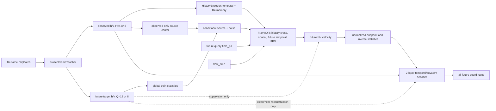

# Frame Joint v1

Frame Joint v1 把历史压缩与未来生成明确分开：历史使用 R4
state/detail memory，未来始终是逐帧 `h/v`，由一个非因果联合 flow 一次建模全部
查询帧。指定旧 codec 只提供冻结的逐帧 target teacher、历史 warm start 和 decoder
coordinate-head warm start。



## 源码入口

| 组件 | 入口 | 职责 |
| --- | --- | --- |
| 类型与边界 | `molvid/latent/types.py` | `FrameLatentBatch`、`ObservedContext`、`QuerySpec`、`HistoryMemory` |
| target teacher | `molvid/codec/frame.py` | 冻结 Haar 前 encoder+stem；四帧分块降低峰值显存 |
| 历史 memory | `molvid/codec/history.py` | 一层差分 temporal；完整 R4 组压缩；不足四帧尾部保留 |
| 统计与时间 | `molvid/latent/statistics.py`, `molvid/time.py` | scalar mean/std、vector xyz 共享 RMS；物理时间与 flow time 分离 |
| flow field | `molvid/dit/frame.py` | history cross → spatial → 双向 future temporal → FFN |
| decoder | `molvid/codec/decoder.py` | 两层整段 temporal/covalent decoder；coordinate head 可训练 warm start |
| 整体模型 | `molvid/model.py` | history、DiT、endpoint、generated/clean/near decode 的显式组合 |
| loss/trainer | `molvid/training/joint.py` | staged optimizer、统一 bond 开关、校准、resume/continuation |
| 数据与 CLI | `molvid/training/batches.py`, `molvid/cli/train_frame_joint.py` | teacher-only no-grad、DDP、cursor/RNG、配置驱动训练 |
| 生成/评估 | `molvid/generation.py`, `tools/evaluate_frame_joint_tiny.py` | observed-only Euler 生成和固定 3/9 tiny 协议 |

## 一个训练 step

1. `prepare_frame_joint_batch` 在 CPU 注册静态拓扑，把 clip 移到 CUDA，并仅在
   frozen teacher 调用中使用 `no_grad`。
2. H4/H8 observed latent、future `QuerySpec`、clean future target 和 conditional
   source 分开构造；真实未来坐标不进入模型条件。
3. `FrameRectifiedFlowObjective` 采样 `flow_time` 与各向同性 source noise；两者不与
   `time_ps` 混用。
4. `FrameJointModel.forward` 依次运行 history encoder、FrameDiT、endpoint inverse
   statistics，以及当前 stage 要求的 decoder branches。
5. `frame_joint_loss` 计算 sample-equal flow/coordinate/bond 项。near branch 的
   endpoint 已 detach；bond release 把 generated/clean/near 三个显式 bond 权重统一置零。
6. DDP 对整个 `FrameJointModel` 同步；flow/clean/generated/near 分别按自己的
   global applicable-sample count 修正 local mean，再做 clip、AdamW 和成功 update 计数。

H8、887 atoms 的真实 inspector shape 为：observed `h=[8,887,128]`、
`v=[8,887,3,128]`，history memory `h=[2,887,256]`、
`v=[2,887,3,128]`，future velocity 与 target 均为
`h=[8,887,128]`、`v=[8,887,3,128]`，坐标输出为 `[8,887,3]`。
接口本身不固定 16 帧。

## 初始化与 checkpoint

- target teacher 来自 codec SHA
  `ba10c44189cca837430abbd64afce2109a0daf0bda4f05971e0441abb2a5e6df`
  的 `frame_encoder` 和 coordinate stem；artifact step 是 39721。
- history R4 state/detail 权重从同一 codec warm start；旧 inverse 模块永久冻结。
- decoder coordinate head 从旧 codec warm copy 后立即设为可训练；其余 decoder、
  FrameDiT 和新的 history temporal 参数为新初始化。
- decoder covalent-message 输出使用普通初始化，外层 local residual gate 为零；只保留
  单侧零初始化，使第一步启动 gate、后续步骤能够训练 message 参数。
- 普通 resume 严格保持模型、loss、数据、optimizer、cursor 和 RNG 契约。
  checkpoint 同时校验完整 stage/update/LR、H 顺序和 LR 公式版本。
  `--continuation-parent` 是独立的新实验：复制 parent weights/moments/cursor/RNG，
  将 child update/scheduler 归零，并在 checkpoint 中记录 parent SHA/step。

审阅前的 `frame_joint_v1_tiny_corrected_260920` checkpoint 保存了旧的双重零初始化；
它只用于固定推理/评估和恢复机制检查，不是修复后训练 parent，也不证明 local topology
分支有效。逐项修复与证据见 `agent/frame_joint_v1/REVIEW.md` 的“修复回应”。

## 常用命令

所有 Python 命令均先进入容器并 `conda activate torch-ito`。

```bash
CUDA_VISIBLE_DEVICES=0 python -m molvid.cli.train_frame_joint \
  --config configs/frame_joint_v1_tiny.yaml --checkpoint-every 3

CUDA_VISIBLE_DEVICES=0 python tools/inspect_model.py --kind frame_joint \
  --checkpoint runs/frame_joint_v1_tiny_corrected_260920/frame_joint_step_00000012.pt \
  --checkpoint-sha256 c7e18d55a7d5e8bebf29c2dbee31470bcd9dfe5ec73003bb03919ef522622c7e \
  --codec /data4/users/sihao/workspace/PVB/outputs/state_detail_codec_v2/t1/full_20260904_seed20260903/ratio4_state_detail/codec_best.pt \
  --codec-sha256 ba10c44189cca837430abbd64afce2109a0daf0bda4f05971e0441abb2a5e6df \
  --store /data4/users/sihao/workspace/PVB/outputs/atlas_selected_trajectories/clip_store/valid \
  --valid-index 0 --history 8 --device cuda:0

CUDA_VISIBLE_DEVICES=0 python tools/evaluate_frame_joint_tiny.py \
  --checkpoint runs/frame_joint_v1_tiny_corrected_260920/frame_joint_step_00000012.pt \
  --checkpoint-sha256 c7e18d55a7d5e8bebf29c2dbee31470bcd9dfe5ec73003bb03919ef522622c7e \
  --codec /data4/users/sihao/workspace/PVB/outputs/state_detail_codec_v2/t1/full_20260904_seed20260903/ratio4_state_detail/codec_best.pt \
  --codec-sha256 ba10c44189cca837430abbd64afce2109a0daf0bda4f05971e0441abb2a5e6df \
  --valid-store /data4/users/sihao/workspace/PVB/outputs/atlas_selected_trajectories/clip_store/valid \
  --output runs/frame_joint_v1_tiny_corrected_260920/evaluation_current \
  --steps 16 --seed 0
```

这 12-update tiny 仅保留为审阅前的数据流/评估 smoke；其坐标与运动指标不构成
修复后 local 分支证据、科学收敛或 production parity。48/192 体系长训练只能在收到任务包中的
`TRAIN_PROMPT.md` 后执行。
